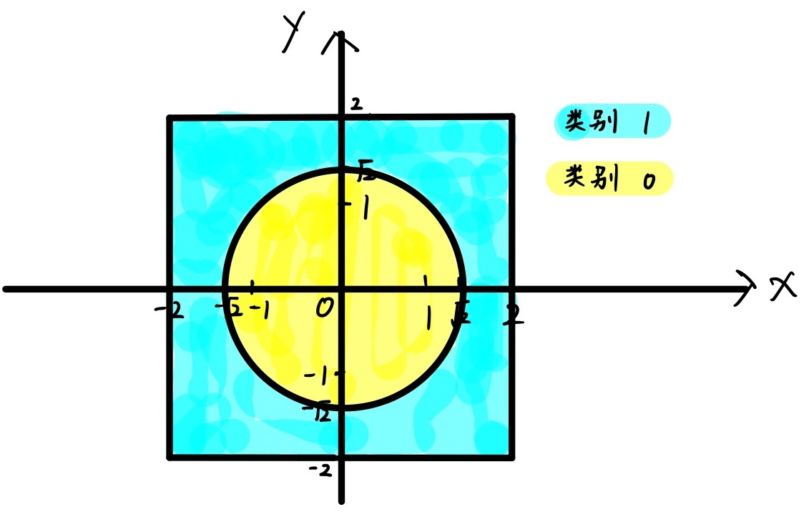
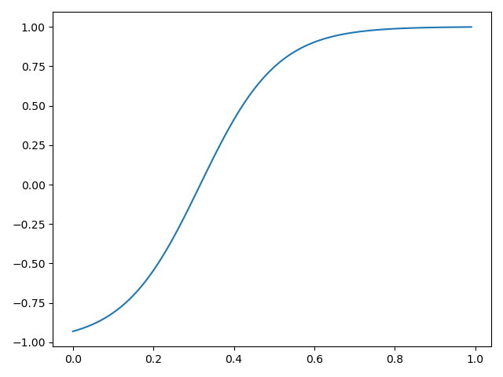
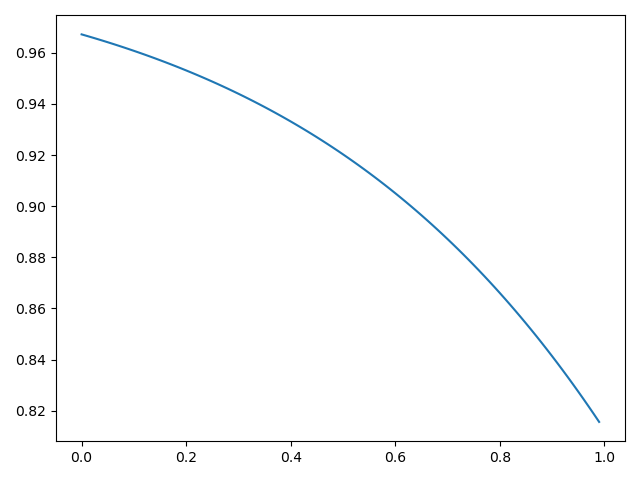
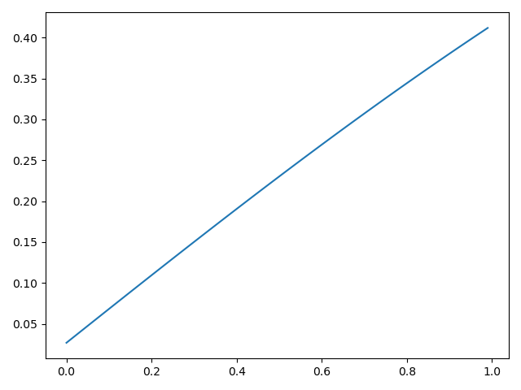
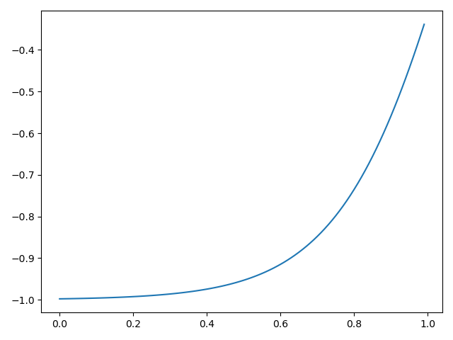
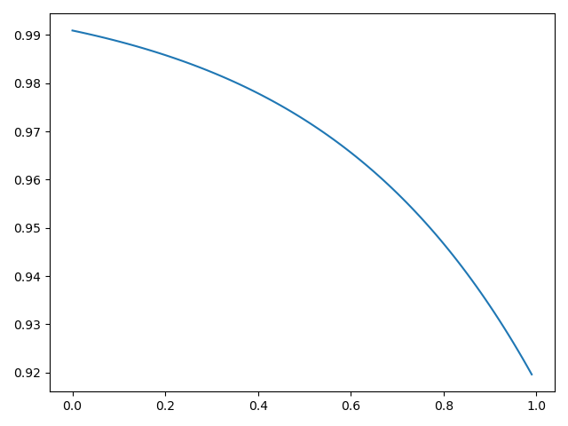
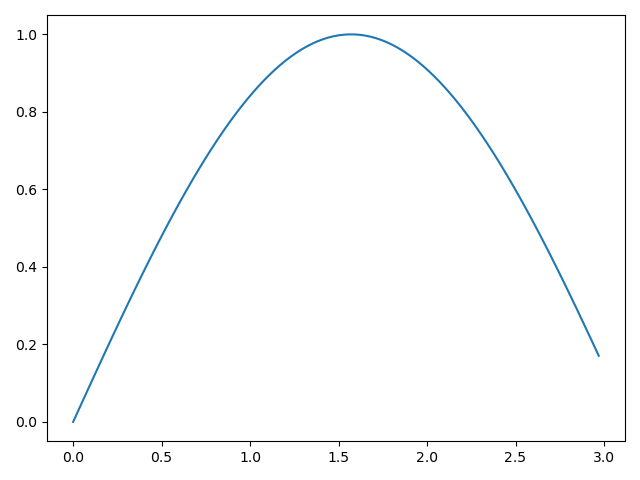
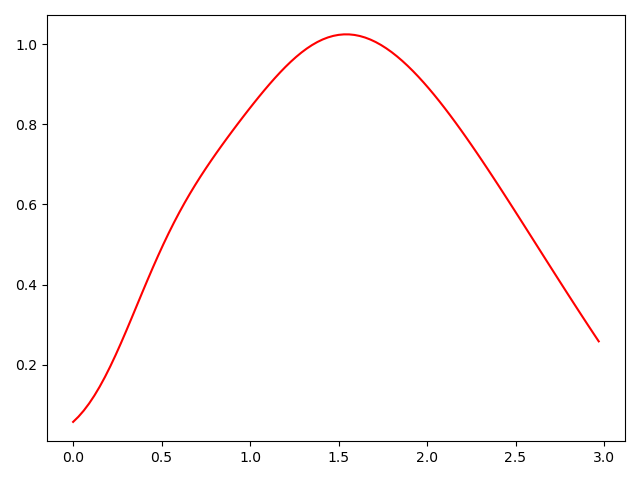

# 第五讲作业 实验报告

舒意恒 MF20330067 计算机科学与技术系


## 问题一

构造的两类数据如图所示：



- 单层感知机训练结果：见 `perceptron_log.txt`，预测准确率 0.722
- BP 神经网络训练结果：见 `neural_network_log.txt`，预测准确率 0.999

该数据是线性不可分的；单层感知机的分类能力有限，在训练过程中 loss 很快进入波动状态，预测准确率在一定迭代次数后就停止提升，稳定在 72.2% 左右；BP 神经网络模型设定隐藏层数量为 2，隐藏层大小为 50，具有一定的非线性分类能力，预测准确率高达 99.9% 左右，能区分圆内的数据点和圆外的数据点。 


## 问题二

程序日志见 `log` 目录中的多个文件，包含训练集上的 loss 变化、测试集上的 loss 以及预测准确率。

在 2000 个 epoch 内，使用同一模型与不同 hidden_size，**测试集**上达到的最高准确率：

| hidden size | test loss |
| ----------- | --------- |
| 50          | 0.9643    |
| 100         | 0.9732    |
| 150         | 0.9716    |
| 300         | 0.9772    |

由不同 hidden size 的实验结果可见，一定程度上，增加隐藏层大小可以增强模型的能力。

可以尝试通过增加隐藏层数量，或改用适用于图像任务的 CNN 进行建模，以进一步提高识别准确率。 


## 问题三

设定学习率为 `0.0001`，训练停止时 loss 在 `0.065`，batch size 设置为 `1`，训练日志详见 `log.txt`，迭代次数 20000. 

隐藏层激活函数 Sigmoid，输出层未使用激活函数。

输入数据的取值范围是 [0, 3)，数据点间隔是 0.03，共 100 个样本点，这对于 $y = \sin(x)$ 函数不是一个周期，网络无法学到关于正弦函数的周期的特征，而只能通过给定数据本身进行学习。


输入-隐藏层的权重和偏置（程序输出如下）：

```
input-hidden layer weight: Parameter containing:
tensor([[ 5.2373],
        [-0.9132],
        [ 0.4150],
        [ 3.0864],
        [-1.1195]], requires_grad=True)

input-hidden layer bias: Parameter containing:
tensor([-1.6582,  2.0476,  0.0269, -3.4080,  2.6947], requires_grad=True)
```

隐藏-输出层的权重和偏置（程序输出如下）：

```
hidden-output layer weight: Parameter containing:
tensor([[ 0.8797,  0.7447, -1.6827,  1.3077,  1.5871]], requires_grad=True)

hidden-output layer bias: Parameter containing:
tensor([-1.4186], requires_grad=True)
```


5 个隐藏神经元的输出：












其中第 2 个隐藏神经元和第 5 个隐藏神经元的输出近似，但不完全一致；第 3 个隐藏神经元是关于输入的线性函数，其他隐藏神经元提供了非线性函数，网络通过不同非线性特征的组合得到输出。


拟合的原曲线（蓝色曲线）与输出神经元的输出（红色曲线）：



