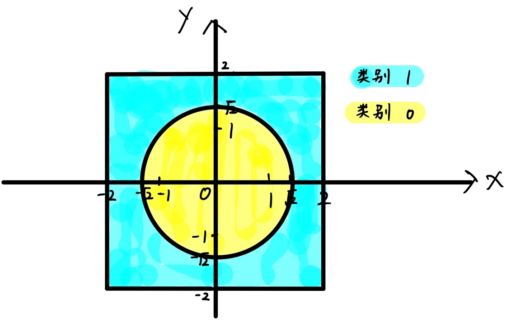

# 第五讲作业 实验报告

舒意恒 MF20330067 计算机系

## 问题一

构造的两类数据如图所示：



单层感知机训练结果：见 `perceptron_log.txt`，预测准确率 0.722

BP 神经网络训练结果：见 `neural_network_log.txt`，预测准确率 0.999

该数据是线性不可分的；单层感知机的分类能力有限，在训练过程中 loss 很快进入波动状态，预测准确率停止提升；BP 神经网络模型设定隐藏层数量为 2，隐藏层大小为 50，具有一定的非线性分类能力，预测准确率高达 99.9% 左右，能区分圆内的数据点和圆外的数据点。 

## 问题二

程序日志见 `log` 目录，包含训练集上的 loss 变化、测试集上的 loss 以及预测准确率。

在 2000 个 epoch 内，使用同一模型与不同 hidden_size，测试集上达到的最高准确率：

- hidden size 50: 0.9643
- hidden_size 100: 0.9732 
- hidden_size 150: 0.9716
- hidden_size 300: 0.9772

一定程度上，增加隐藏层大小可以增强模型的能力。

可以尝试通过增加隐藏层数量，或改用适用于图像任务的 CNN 进行建模，以进一步提高识别准确率。 


## 问题三

设定 loss 在 0.0001 时训练停止，训练停止时误差为 9.9976-05，迭代次数 1606.
隐藏层大小被设定为 50.


输入层、输出层的权重和偏置：

```
input layer weight: Parameter containing:
tensor([[ 1.1853],
        [ 0.8662],
        [ 2.0296],
        [ 1.5923],
        [-0.2409],
        [-1.9080],
        [-0.1379],
        [-0.8771],
        [ 0.8686],
        [ 2.0242],
        [-0.0394],
        [-0.2371],
        [ 2.1792],
        [ 1.8783],
        [ 2.8386],
        [-1.1351],
        [ 0.8941],
        [-2.1058],
        [ 2.3412],
        [ 2.3144],
        [ 1.2600],
        [-1.0203],
        [-0.4437],
        [ 0.4710],
        [ 1.2346],
        [ 1.4572],
        [-0.2800],
        [ 1.6038],
        [ 0.0427],
        [ 2.0583],
        [ 1.1534],
        [ 1.3237],
        [ 1.2331],
        [-1.1397],
        [-0.2324],
        [-0.5792],
        [ 2.0114],
        [ 1.3714],
        [-1.5885],
        [ 0.2058],
        [ 1.6708],
        [ 1.6465],
        [ 1.8354],
        [ 2.1905],
        [ 1.4520],
        [-0.7963],
        [ 0.1156],
        [ 0.0451],
        [ 0.2724],
        [ 0.3563]], requires_grad=True)


input layer bias: Parameter containing:
tensor([ 0.6022,  1.5112,  0.9747,  0.0039,  0.3977, -0.5116,  0.1152, -1.3411,
         1.6322,  0.3142,  0.8912, -1.3673,  0.4207,  1.2246,  0.7975,  1.1236,
         0.0370, -0.6771,  0.3844,  0.9228,  0.2236,  1.0247,  0.8557, -0.0442,
        -0.4065,  0.4412, -0.1396,  0.0339,  0.0587,  0.0329,  0.0038,  0.0142,
         1.3350,  1.1276, -0.7954, -0.7301,  0.6566,  1.8401, -0.4660, -0.0395,
         1.4541, -0.0061,  0.5220,  0.8032,  0.9417,  0.7802, -0.3836,  1.3560,
        -0.2316, -1.0986], requires_grad=True)


output layer weight: Parameter containing:
tensor([[ 1.0317,  0.2258,  0.0901, -0.6819, -0.2375, -0.5099, -0.2261, -0.2873,
          1.6762,  0.0022,  0.3100, -0.4339, -1.0375,  1.8458,  0.7246, -0.0143,
          0.1078, -0.2236, -0.7320,  2.1140, -1.8014, -0.3227, -0.1289,  0.0170,
          0.5456,  0.4704,  0.0871,  0.1687,  0.1503,  0.3525,  0.0633,  0.1640,
         -0.0483, -1.0130, -0.2680, -0.0730,  0.4561, -0.0431, -0.3653,  1.7532,
         -0.6357,  0.2792,  0.2097,  1.6922, -0.0684, -0.4482, -1.3454,  1.2565,
         -0.0962,  0.4708]], requires_grad=True)


output layer bias: Parameter containing:
tensor([-0.1452], requires_grad=True)
hidden layer 0 output: tensor([-7.5674e-03, -2.4196e-02, -1.2077e-03,  5.5961e-01,  1.4582e+00,
         7.2384e-01,  1.6951e-01, -1.5381e-02, -2.1500e-02,  1.5940e+00,
         1.7769e+00,  5.0829e-01,  4.3247e-01,  9.6086e-02,  1.9632e-01,
        -4.1441e-05,  5.0684e-01,  1.6422e+00, -9.9432e-03,  1.6515e+00,
        -1.9900e-02, -5.8858e-03,  1.8809e+00, -9.7127e-04,  1.1878e+00,
         2.8022e+00, -5.1138e-06, -2.7706e-02, -3.7265e-05, -3.0982e-03,
         8.8808e-01,  7.2817e-01,  1.9375e+00,  2.9375e+00, -3.0138e-05,
        -1.2705e-02, -1.6294e-03, -5.2557e-03, -2.2687e-02,  2.2034e-01,
         1.6127e+00, -3.1798e-03, -1.2308e-02,  1.1725e+00,  2.6206e+00,
        -9.7797e-03,  7.5744e-01,  5.9045e-02, -1.1106e-02,  6.2366e-01],
       grad_fn=<LeakyReluBackward0>)
```

