# 第八讲作业 随机神经网络

舒意恒 MF20330067 计算机科学与技术系

yhshu@smail.nju.edu.cn


## 参数设置

- T_max：最大温度
- T_min：最小温度
- L：链长
- max_stay_counter：冷却耗时

## 模型设置

### 模型 SA

算法概述如下：

```
    u ~ Uniform(0, 1, size = d)
    y = sgn(u - 0.5) * T * ((1 + 1/T)**abs(2*u - 1) - 1.0)

    xc = y * (upper - lower)
    x_new = x_old + xc

    c = n * exp(-n * quench)
    T_new = T0 * exp(-c * k**quench)
```

###  模型 SABoltzmann

算法概述如下：

```
    std = minimum(sqrt(T) * ones(d), (upper - lower) / (3*learn_rate))
    y ~ Normal(0, std, size = d)
    x_new = x_old + learn_rate * y

    T_new = T0 / log(1 + k)
```

## 实验效果

以下实验中，当 x1、x2 没有明显变化时，y 仍然有明显变化。这是因为此时 x 的变化相对于整张图而言较为微小。


### 第一组实验

本组实验关注于最高温度与最低温度两个参数。

**实验 #1 设置与结果**

T_max = 100, T_min = 1e-7, L = 300, max_stay_counter = 150

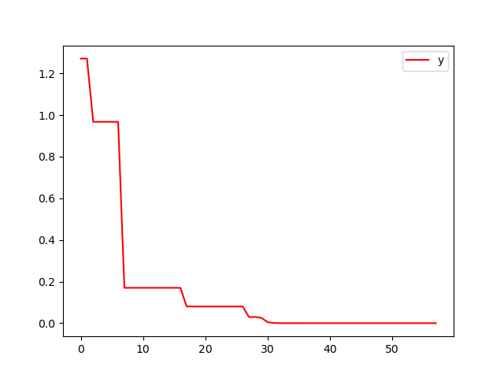
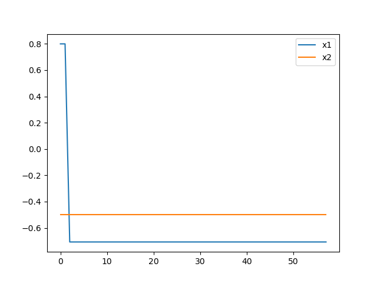

**实验 #2 设置与结果**

T_max = 1, T_min = 1e-7, L = 300, max_stay_counter = 150

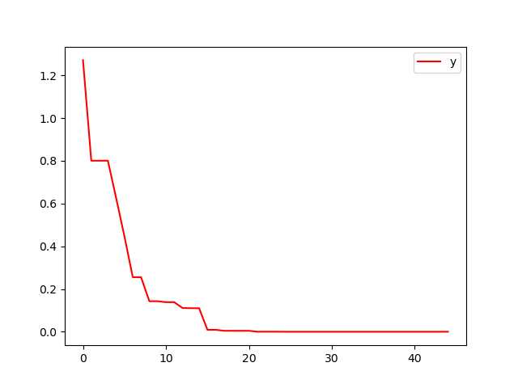
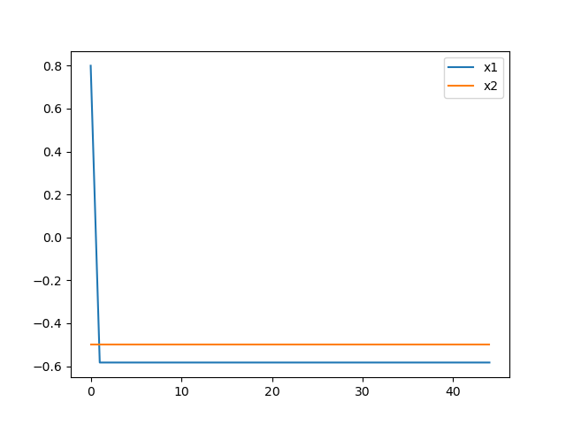

**实验 #3 设置与结果**

T_max = 1, T_min = 1e-9, L = 300, max_stay_counter = 150

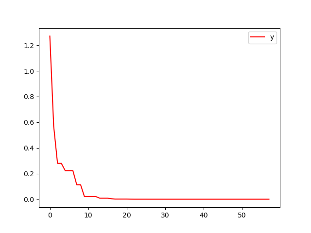
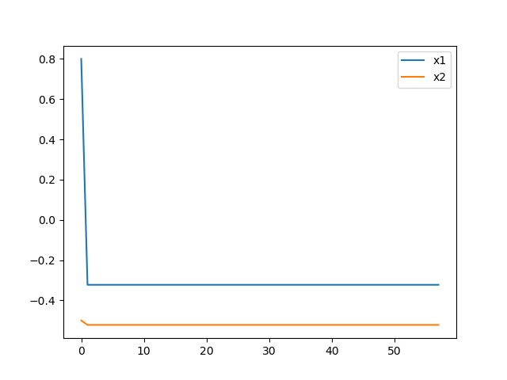


由第一组实验，`T_max = 1, T_min = 1e-9` 导致了较快的收敛，是相对合适的参数，后续实验中将使用这组参数。

### 第二组实验

本组实验关注于链长和冷却耗时两个参数。

**实验 #4 设置与结果**

T_max = 1, T_min = 1e-9, L = 200, max_stay_counter = 150

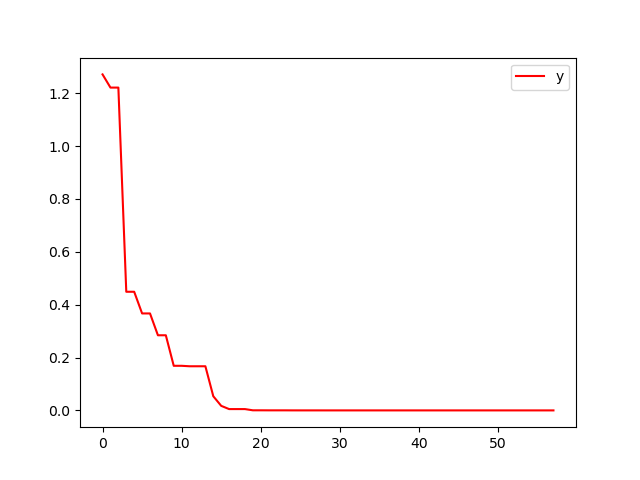
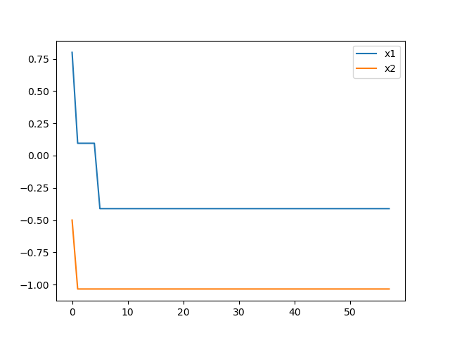

**实验 #5 设置与结果**

T_max = 1, T_min = 1e-9, L = 100, max_stay_counter = 150

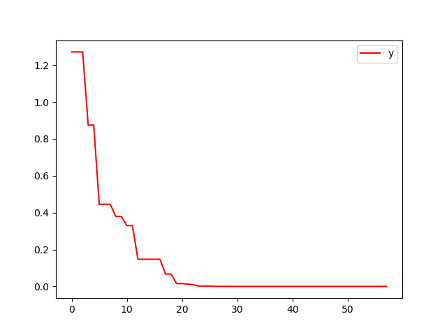
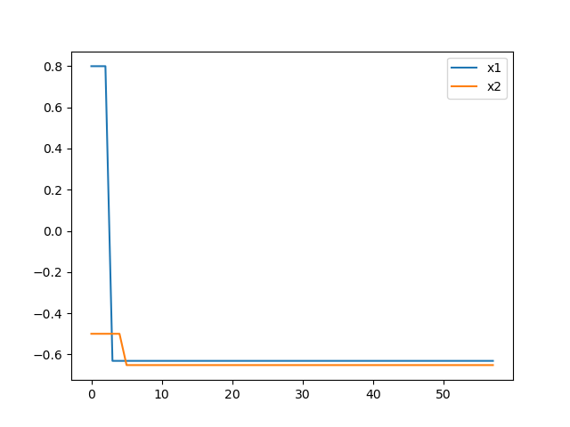

**实验 #6 设置与结果**

T_max = 1, T_min = 1e-9, L = 300, max_stay_counter = 100

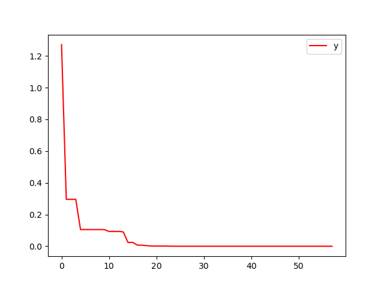
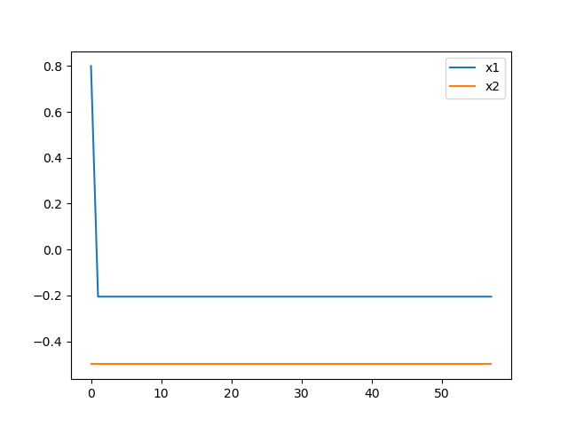

**实验 #7 设置与结果**

T_max = 1, T_min = 1e-9, L = 300, max_stay_counter = 200

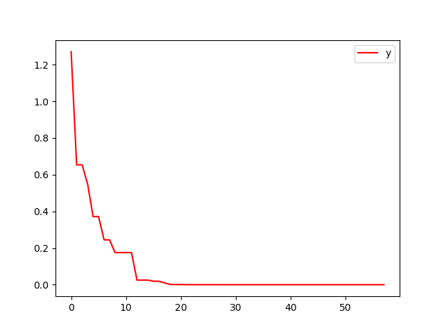
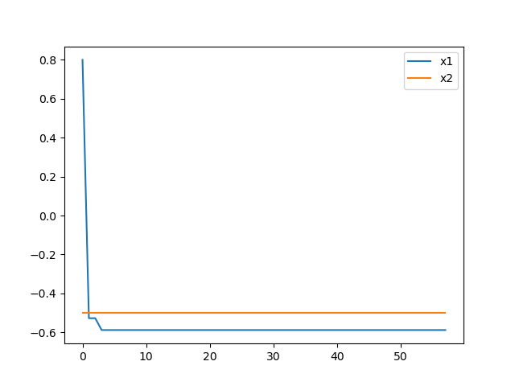


由第二组实验，与实验 #3 相比，`L = 300, max_stay_counter = 150` 导致了较快的收敛，是相对合适的参数，后续实验将使用这组参数。

### 第三组实验

本组实验关注于 `SA` 与 `SABoltzmann` 两种模型的选择。

